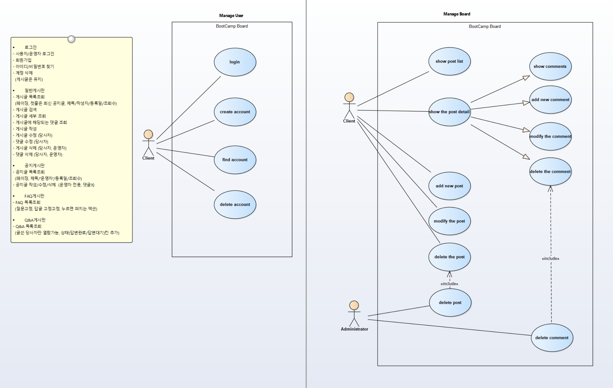
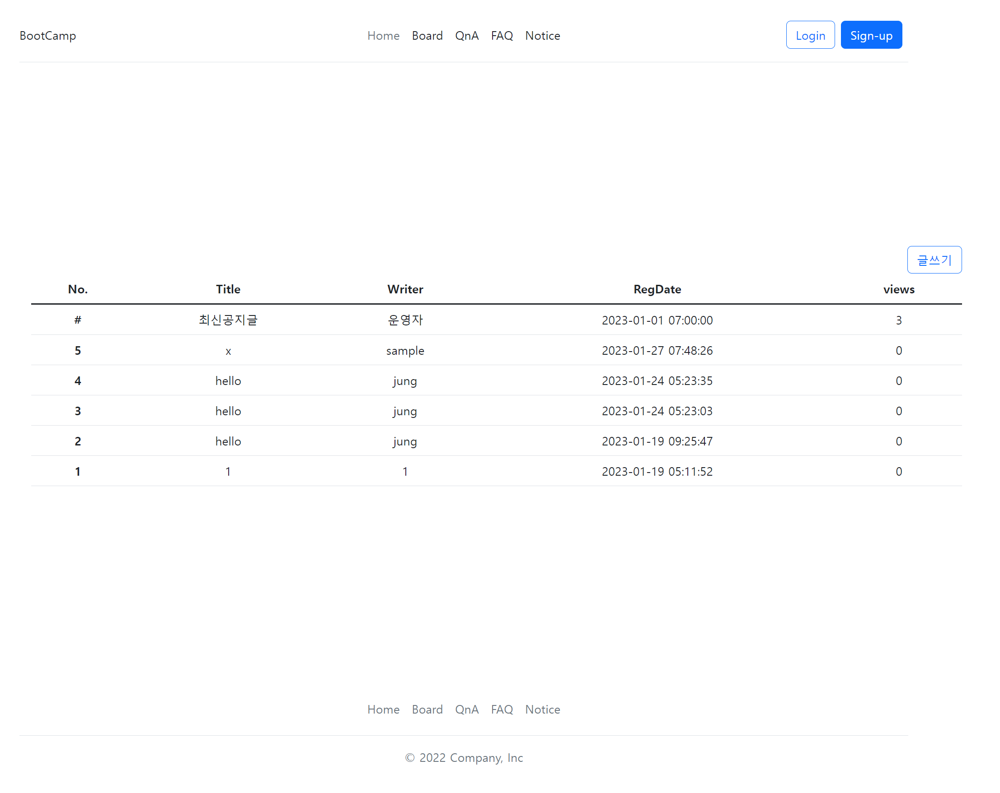
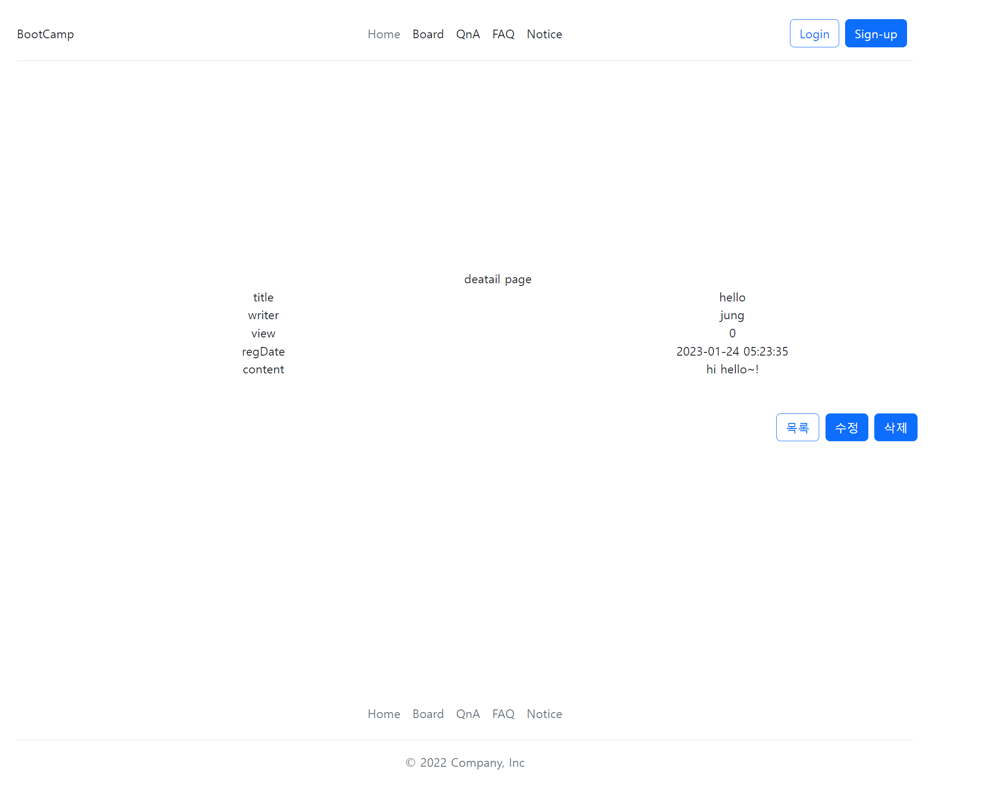

# BootCamp

### 1-1주차
Spring
- [spring 개요](./note/text/Spring.md)
- [spring data JPA](./note/text/Spring_jpa.md)

### 1-2주차
React
- [React 개요](./note/text/React.md)
- Component by Class (나무소리)
  - [props](./note/text/React_props.md)
  - [state](./note/text/React_state.md)
  - [lifeCycle](./note/text/React_LifeCycle.md)
- Component By Function (벨로퍼트)
- State관리 : [MobX](./note/text/React_MobX.md)
- router사용

### 1-3주차
  

### 1-4주차
- [개발환경 구성](./note/text/개발환경구성.md)
- `localhost:5173/board`  
  

- `/localhost:5173/board/4ba60956-8d19-4fc4-adc2-e0317d9724c2`   
  
